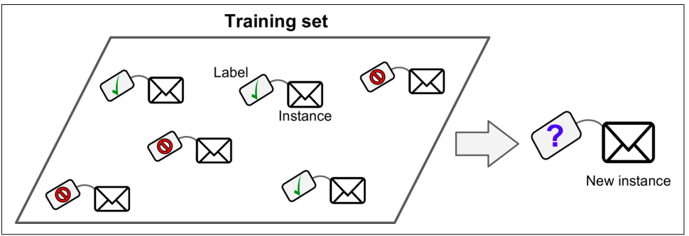
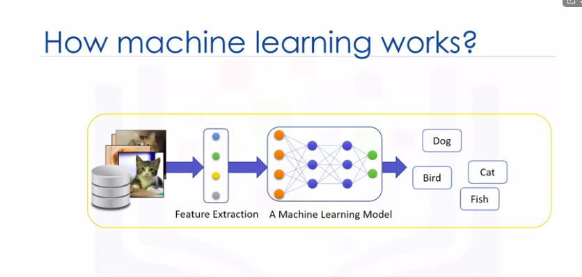

# Mechine Learning

#### -> Machine Learning is the science (and art) of programming computers so they can learn from data.

## Types of Machine learning
___
- ML
    - [Supervised](##supervised)
    - [Unsupervised](#unsupervised)
    - [Semisupervised](#semi)
    - [Reinforcement](#reinforcement)
    - [Introduction](#Introduction-To-machine-learnin)

## Supervised Learning
---

### Types of Supervised learning Algorithms

- Supervised Learning
    - k-Nearest Neighbors
    - Linear Regression
    - Logistic Regression
    - Support Vector Machines (SVMs)
    - Decision Trees and Random Forests
    - Neural networks

# Introduction-To-machine-learning

### How mahcine learning work ?

    

### Python libraries for mahcine learing

