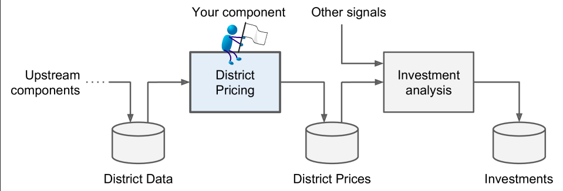
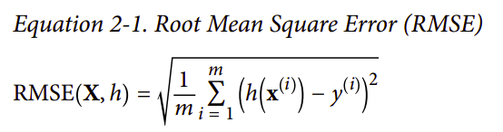
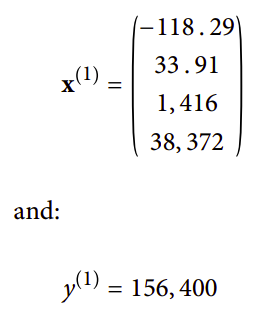

*A Sequence of data processing components is called a data pipline* 

Note:If the data was huge, you could either split your batch learning
work across multiple servers (using the MapReduce technique), or
you could use an online learning technique instead.

***RMSE***:

- For example, if you are evaluating the RMSE on a validation set of 2,000 dis‐
tricts, then m = 2,000

- x(i) is a vector of all the feature values (excluding the label) of the ith instance in the dataset, and y(i) is its label (the desired output value for that instance).

    - For example, if the first district in the dataset is located at longitude–118.29°,latitude 33.91°, and it has 1,416 inhabitants with a median income of $38,372,and the median house value is $156,400 (ignoring the other features for now),then: 
    

- h is your system’s prediction function, also called a hypothesis. When your system is given an instance’s feature vector x(i), it outputs a predicted value ŷ(i) = h(x(i))
for that instance (ŷ is pronounced “y-hat”).
    - For example, if your system predicts that the median housing price in the first district is $158,400, then ŷ(1) = h(x(1)) = 158,400. The prediction error for this district is ŷ(1)– y(1) = 2,000.
    - RMSE(X,h) is the cost function measured on the set of examples using your hypothesis h.   

    